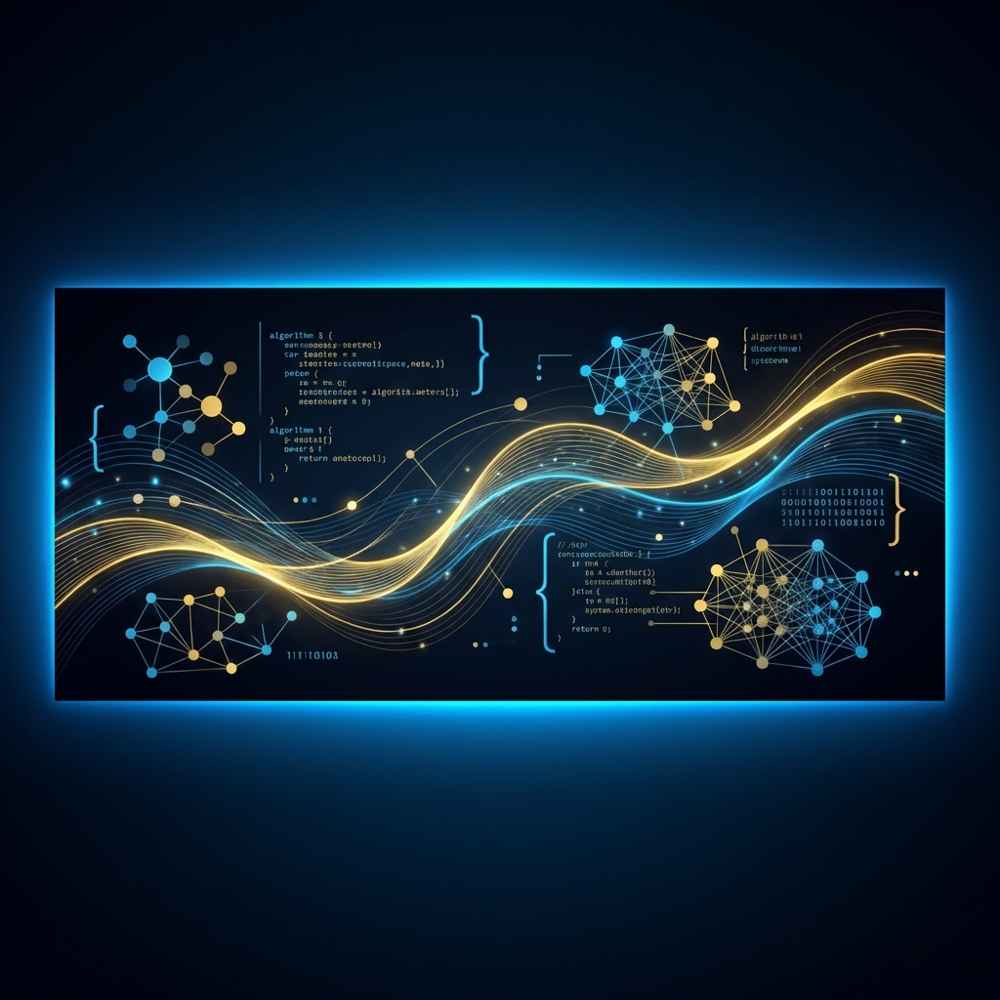

 

# Hi, I'm Ly Chungheang

### Data Science Engineering Student | Machine Learning | Computer Vision

  
  
  

---

## About Me

I am a fourth-year **Data Science Engineering** student at the
**Institute of Technology of Cambodia**, with an expected graduation date of
August 2027.

- Building practical solutions with machine learning, data engineering, and computer vision
- Experienced with OCR, forecasting, real-time data pipelines, and secure web systems
- Interested in data science internships, research collaborations, and junior ML roles
- Based in Phnom Penh, Cambodia
- Languages: Khmer (native), English (upper-intermediate), and French (elementary)

---

## Technical Skills

  

  

  

| Area | Technologies |
| --- | --- |
| **Programming** | Python, JavaScript, SQL, R, LaTeX |
| **Machine Learning** | Scikit-learn, PyTorch, TensorFlow, YOLOv8, CNN, CRNN |
| **Computer Vision** | OCR, Tesseract, image processing, object detection |
| **Data & Analytics** | Pandas, NumPy, Matplotlib, Power BI, Excel, statistics |
| **Web & Systems** | FastAPI, Flask, Django, React, Next.js, Node.js, NestJS |
| **Databases & Tools** | PostgreSQL, MongoDB, SQLite, Docker, Git, Jupyter, MLflow |

---

## Featured Projects

### Unemployment Prediction Using Economic Indicators

Machine learning research project that predicts unemployment rates using economic
and labor-market data covering more than 200 countries.

- Engineered lag, rolling-average, GDP, and labor-force features
- Compared regression and ensemble models
- Achieved a best **R² score of 0.976**
- Built visualizations for model performance and global unemployment trends

**Tech:** Python, Pandas, NumPy, Scikit-learn, Matplotlib, Seaborn

[View source code](https://github.com/Chungheang0980/Unemployment_Economic_Indicators)

### Real-Time Stock Market Data Pipeline

End-to-end stock market analytics and forecasting platform with real-time data
collection, transformation, storage, APIs, and dashboards.

- Built an ETL pipeline using data from the Finnhub API
- Designed Bronze, Silver, and Gold warehouse layers
- Added forecasting models with MLflow experiment tracking
- Delivered monitoring and analysis through FastAPI and Streamlit

**Tech:** Python, PySpark, PostgreSQL, FastAPI, Streamlit, MLflow, Docker

[View source code](https://github.com/Chungheang0980/Stock_Market_realtime-)

### Bank Transaction Scanner

OCR-based full-stack system that identifies bank receipts and extracts structured
transaction information.

- Classified ABA and ACLEDA receipts using a CNN
- Extracted transaction ID, date, amount, and currency
- Built validation pipelines and report export
- Selected as an outstanding project at the 14th Scientific Day Showcase

**Tech:** Python, FastAPI, Next.js, TensorFlow, Tesseract OCR, MongoDB, Docker

[View source code](https://github.com/chantharith-NY/Bank-Transaction-Scanner) ·
[Video demo](https://drive.google.com/file/d/1JHiaJd2DK4XvmEBCEJ991nJBtzr4DUgR/view?usp=drive_link) ·
[Poster](https://drive.google.com/file/d/1cEEC1kVl-bPMP6XwjZjKTbeGH_JgSaFp/view?usp=drive_link)

### SecureBG Banking Web System

Secure banking application with protected authentication and complete transaction
workflows.

- Implemented password hashing and role-based access control
- Added deposits, withdrawals, transfers, and transaction history
- Integrated fraud detection and audit logging

**Tech:** Python, Flask, SQLite, Docker, XML-RPC, HTML, CSS, JavaScript

[View source code](https://github.com/Chungheang0980/Banking-Security)

---

## Experience

### Khmer OCR and Plate Recognition
**ReDA Laboratory, ITC | June 2025 - August 2025**

- Developed a Khmer license plate detection and OCR system for cars and motorbikes
- Collected data in daylight, night, rain, and dusty conditions
- Used YOLOv8 for detection and CRNN-Keras for Khmer and Latin character recognition

### IT Support
**22nd CamTESOL Conference | February 2025**

- Supported computers, projectors, audio equipment, speakers, and conference sessions
- Monitored technical equipment and resolved issues during the event

### BACLL Organizer
**ACU, Lycée Preah Angduong | August 2025**

- Assisted with registration, participant communication, and event logistics

### Volunteer Teaching Coordinator
**TSK, Phnom Penh | February 2024 - March 2024**

- Taught self-reliance lessons about planning, goal setting, and problem-solving

---

## Education

| Program | Institution | Year |
| --- | --- | --- |
| **Engineer, Data Science** | Institute of Technology of Cambodia | Expected August 2027 |
| **Adults English Program** | Institute of Foreign Languages | Graduated March 2026 |
| **High School Diploma** | Lycée Preah Angduong | Graduated 2022 |

---

## Certifications

- Data Privacy Fundamentals
- Python 101 for Data Science
- 14th Scientific Day
- BACLL Organizer - ACU
- 22nd CamTESOL Conference

---

## GitHub Statistics

---

## Contact

- **Email:** [lychungheang16@gmail.com](mailto:lychungheang16@gmail.com)
- **Phone:** [+855 88 719 9719](tel:+855887199719)
- **GitHub:** [github.com/Chungheang0980](https://github.com/Chungheang0980)
- **Location:** Phnom Penh, Cambodia

### Thank you for visiting my profile.

